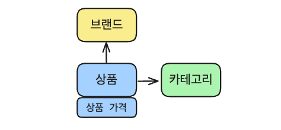
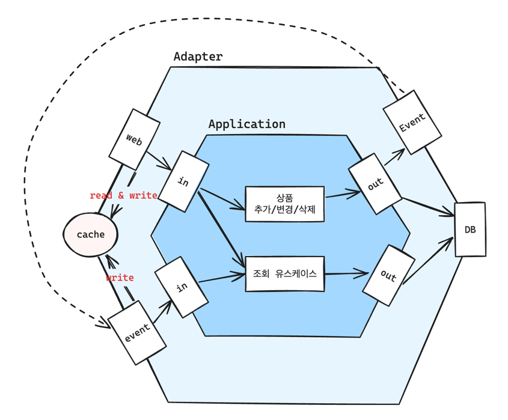

# product-cody 프로젝트

# 실행 방법

API 서버 실행

```
# 1. 프로젝트 빌드
./gradlew clean build

# 2. redis 로컬 실행
docker-compose up -d

# 3. API 서버 실행
./gradlew bootRun
```

테스트 실행

```
# 테스트 코드 실행
./gradlew test

# api 문서

## 1.  테스트 & 문서 생성
./gradlew copyApiDoc

## 2. 프로젝트 빌드
./gradlew build -x test

## 3. API 서버 실행
docker-compose up -d
./gradlew bootRun

## 4. API 문서 확인
## http://localhost:8080/static/swagger-ui.html
```

# 프로젝트 설명

8개의 카테고리에서 상품을 하나씩 구매하여 코디를 완성하는 서비스

## 기능 요구사항

- 상품 관리
  - [x]  브랜드 생성 API
  - [x]  상품 추가 API
  - [x]  상품 변경 API
  - [x]  상품 삭제 API
- 상품 조회
  - [x]  카테고리 별 최저가격 브랜드와 상품 가격, 총액 조회 API
  - [x]  단일 브랜드로 모든 카테고리 상품을 구매할 때 최저가격에 판매하는 브랜드와 카테고리의 상품가격 총액 조회 API
  - [x]  카테고리 이름으로 최저, 최고 가격 브랜드와 상품 가격 조회 API

## 도메인

프로젝트 요구사항을 바탕으로 `브랜드`, `카테고리`, `상품`이라는 도메인 엔티티를 도출했습니다.



`브랜드`

- 역할 & 책임
  - 여러 상품들이 소속될 수 있는 개념을 제공
- 주요 속성
  - 이름

`카테고리`

- 역할 & 책임
  - 상품들이 분류될 수 있는 카테고리라는 개념을 제공
- 주요 속성
  - 이름

`상품`

- 역할 & 책임
  - 상품의 세부 정보들을 관리
  - 어떤 브랜드, 카테고리에 소속될지 스스로 결정
- 주요 속성
  - 브랜드
  - 카테고리
  - 상품명
  - `상품 가격`
    - 역할 & 책임
      - 특정 상품을 얼마의 가격으로 팔 것인가를 결정
    - 주요 속성
      - 가격

## 아키텍처

애플리케이션 핵심 로직이 외부 라이브러리 & 외부 시스템을 의존하지 않는 구조를 위해 육각형 아키텍처를 사용했습니다.



- `adapter`
  - admin : 상품 관리 관련 외부 의존성 & 외부 시스템 연동을 담당
  - common : 어댑터 영역에서 공통으로 사용될 항목들을 선언
  - out.persistence.table : 어댑터 영역에서 공통으로 사용하는 영속성 매핑 클래스 선언
  - product : 상품 조회 관련 외부 의존성 & 외부 시스템 연동을 담당
- `application`
  - admin : 상품 관리 비즈니스 요구사항 구현
  - exception : 애플리케이션 계층에서 사용될 예외 클래스 선언
  - product : 상품 조회 비즈니스 요구사항 구현
- `domain`

## 기능

### 상품 조회

`카테고리 별 최저가격 브랜드와 상품 가격, 총액 조회`
- 조회 정책 : 카테고리별 최저 가격이 동일한 상품의 경우 우선순위를 위한 정책 설정
  - 신규 브랜드 판매 촉진을 위해, 같은 가격인 경우 ‘최근에 등록한 브랜드’ 상품을 노출
- 응답 캐싱 처리
  - DB 부하 감소 및 응답 속도 개선을 위한 응답 캐싱(TTL 5분)
  - ‘상품 정보 변경’ 이벤트 발생시 캐시 갱신

`단일 브랜드로 모든 카테고리 상품을 구매할 때 최저가격에 판매하는 브랜드와 카테고리의 상품가격 총액 조회`
- 조회 정책 : 단일 브랜드의 모든 카테고리 상품 가격 합이 같은 경우 우선순위를 위한 정책 설정
  - 신규 브랜드 판매 촉진을 위해, 같은 가격인 경우 ‘최근에 등록한 브랜드’ 상품을 노출
- 응답 캐싱 처리
  - DB 부하 감소 및 응답 속도 개선을 위한 응답 캐싱(TTL 5분)
  - ‘상품 정보 변경’ 이벤트 발생시 캐시 갱신

`카테고리 이름으로 최저, 최고 가격 브랜드와 상품 가격 조회`
- 응답 캐싱 처리
  - DB 부하 감소 및 응답 속도 개선을 위한 응답 캐싱(TTL 5분)
  - ‘상품 정보 변경’ 이벤트 발생시 캐시 갱신
  - 카테고리별로 캐시 key 를 분리하여 별도로 관리

### 상품 관리
`상품 추가 / 변경 / 삭제`
- 추가, 변경, 삭제 유스케이스가 성공하면 ‘상품 정보 변경’ 이벤트를 발행함

`브랜드 생성`

### 개선이 필요할 수 있는 포인트

> 상품 추가 / 변경 / 삭제는 성공했는데 ‘상품 정보 변경’ 이벤트 발행은 실패하는 경우

이런 문제가 발생하면, 캐시가 유효한 동안 정확하지 않은 데이터를 응답하는 문제가 발생할 수 있는데요.

위와 같은 문제가 발생할 수 있는 리스크를 줄이기 방법으로 캐시에 5분의 TTL 을 설정했습니다.

하지만, 실시간(혹은 준 실시간) 조회 요구사항이 있다면 현재 방식으로는 힘들 수 있는데요.

이에 대응할 수 있는 방법으로 2가지가 있을 것 같습니다.

1. 캐시 TTL 을 더 줄이는 방법 

    이 방법은 `짧은 캐시 TTL` 을 통해 `캐시가 자주 만료`되게 하는 방법입니다.

    자주 만료되니 이벤트를 통한 갱신이 실패하더라도, 만료된 후 요청시 캐시가 생신되는데요.

    하지만 그 만큼 더 자주 DB로 쿼리하고, Redis 에 캐시를 세팅하니 기존보다 더 많은 부하를 준다는것을 유의해야 할 것 같습니다.

2. 스케줄 작업 실행

    TTL 보다 짧은 주기로 `스케줄 작업을 실행`하여, `캐시를 자주 갱신`하는 방법입니다.
    
    하지만, 요청이 오지 않음에도 캐시가 계속 갱신되며 필요 이상으로 서버 리소스를 사용하게 될 수 있고,
    
    서버가 수평 확장 되는 경우 중복처리 방지를 위해 분산락을 구현하거나, 분산 스케줄링이 가능한 시스템을 구축해야 할 수 있습니다

> 상품 추가 / 변경 / 삭제시 마다 캐시 갱신이 일어나는 것

상품 추가 / 변경 / 삭제 주기가 캐시 TTL 보다 짧으면 캐시 갱신이 자주 일어나는 문제가 발생할 수 있는데요.

이는 이벤트 큐를 이용하거나, 상품 갱신 플래그를 저장해놓고 스케줄링을 통해 지연처리하는 방법으로 개선할 수 있습니다.

이를 해결하기 위한 방법으로 이벤트 큐(혹은 캐시 갱신이 필요하다는 플래그)를 이용하는 방법이 있습니다.

그 다음 위의 2번의 방법을 통해 갱신이 필요하다면, 갱신 작업을 처리할 수 있을 것 같습니다.